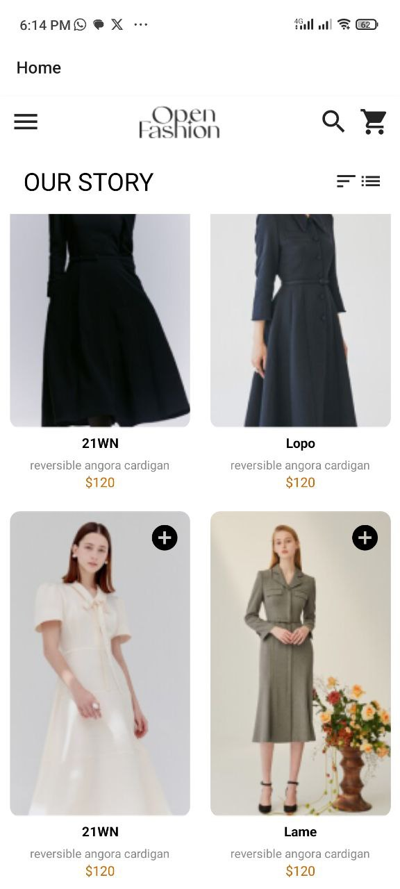

# Project README
#### Author: AKPEMADA NKROW
#### ID: 11021370
#### Date: 2021-12-06
#### Description: This is an assignment for the course "Moblie App Development" at the University of Ghana

## Overview
This project is a showcase of a web application's user interface, featuring two main pages: the Home page and the Checkout page. The application's design and layout are demonstrated through a series of screenshots.

## Home Page
The Home page is the main entry point of the application, providing users with an introduction to the platform. The page is designed to be visually appealing, with a clean and modern layout.

### Screenshots
The following screenshots provide a detailed look at the Home page:

### ScreenHome Screen

  ## Home page

##  Checkout Screen
The Checkout page is a critical component of the application, allowing users to complete their transactions securely and efficiently. The page is designed to be easy to use, with clear instructions and minimal distractions.

### Screenshots
The following screenshots provide a detailed look at the Checkout page:

### Checkout Screen
  ## Checkout page

## Assets
All screenshots are stored in the `./assets/screenshots` directory.

## Screens
All screens are stored in the `./Screens` directory.

